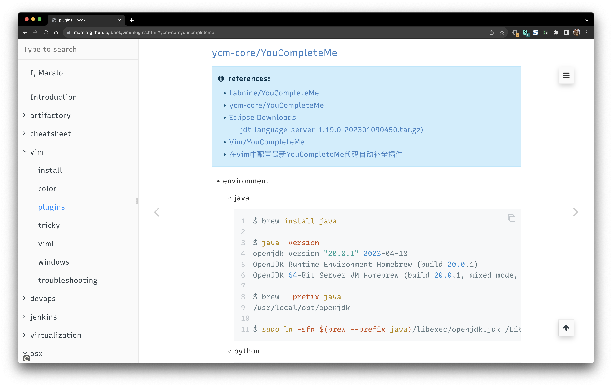
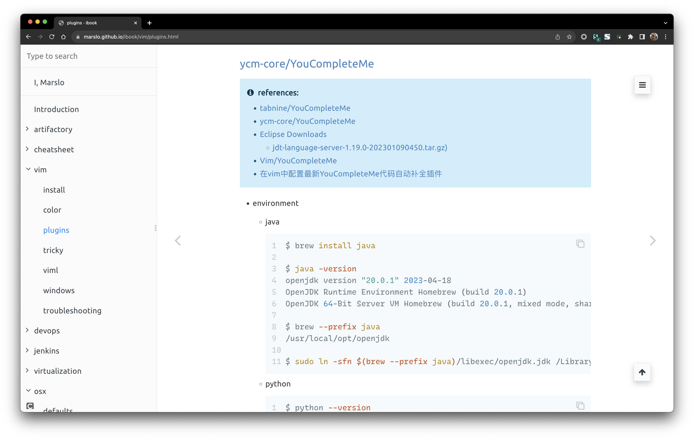

<!-- START doctoc generated TOC please keep comment here to allow auto update -->
<!-- DON'T EDIT THIS SECTION, INSTEAD RE-RUN doctoc TO UPDATE -->
**Table of Contents**  *generated with [DocToc](https://github.com/thlorenz/doctoc)*

- [global fonts ( marslo )](#global-fonts--marslo-)
  - [v2.0.5](#v205)
  - [v2.0.4](#v204)
  - [v2.0.3](#v203)
- [fonts download](#fonts-download)
  - [sans](#sans)
  - [mono](#mono)
- [some features](#some-features)
  - [gerrit comments](#gerrit-comments)

<!-- END doctoc generated TOC please keep comment here to allow auto update -->


## [global fonts ( marslo )](https://userstyles.world/style/5264/global-fonts-marslo)

> legacy project:
> - [marslo ( ubuntu )](https://userstyles.world/style/5264/marslo-ubuntu)

### v2.0.5



### v2.0.4



### v2.0.3


## fonts download

> more details:
> - [iMarslo: fonts](https://marslo.github.io/ibook/tools/fonts.html)

### sans
- [ubuntu](https://design.ubuntu.com/font) | [preview](https://fonts.google.com/specimen/Ubuntu)
- [Recursive]() | [preview](https://fonts.google.com/specimen/Recursive)
- [Candara](https://www.dafontfree.io/candara-font/)
- [Gisha](https://learn.microsoft.com/en-us/typography/font-list/gisha)
- [Titillium](https://fonts.adobe.com/fonts/titillium-web) | [preview](https://fonts.google.com/specimen/Titillium+Web)

### mono
- [Monaco](https://www.cufonfonts.com/font/monaco)
- [Rec Mono Causal](https://github.com/arrowtype/recursive/tree/main/fonts/ArrowType-Recursive-1.085/Recursive_Code)
- [Comic Mono](https://dtinth.github.io/comic-mono-font/)
- [Gohu](https://github.com/ryanoasis/nerd-fonts/tree/master/patched-fonts/Gohu)
- more:
  - [nerd-font](https://www.nerdfonts.com/font-downloads) | [ryanoasis/nerd-fonts](https://github.com/ryanoasis/nerd-fonts)
  - [powerline/fonts](https://github.com/powerline/fonts)

## some features
### gerrit comments

- `background: #083750` : for [solarized color style](https://ethanschoonover.com/solarized/)
- `background: #303030` : for dark background
- `background: #3a122e` : for ubuntu style background

```css
gr-linked-text[class*="pre"],
.gr-formatted-text-0 gr-linked-text.pre.gr-formatted-text,
gr-linked-text[class*="pre"] #output {
  font-family: "Monaco", "Menlo", "Andale Mono", "Ubuntu Mono", "monofur", "Consolas" !important;
  color: #eee !important;
  background: #083750 !important;                 /* solarized style */
  /* background: #303030 !important; */           /* dark background */
  border-radius: .75em !important;
  box-shadow: 0 4px 8px 0 rgb(0 0 0 / 20%), 0 6px 20px 0 rgb(0 0 0 / 19%);
  overflow: auto;
  display: block;
  padding: 8px;
  margin: -5px;
}
```

- result
  - ubuntu
    

  - solarized
    

  - dark
    
